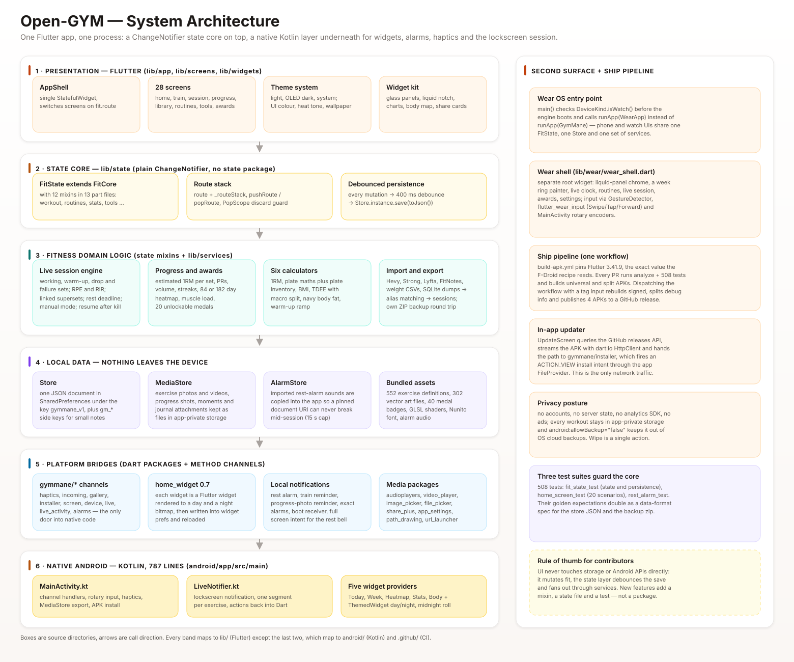
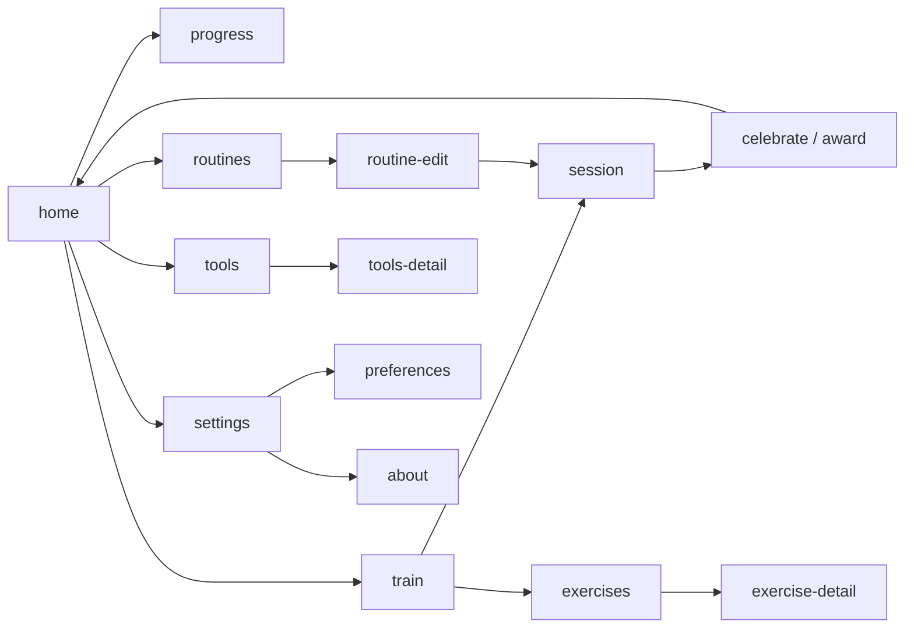
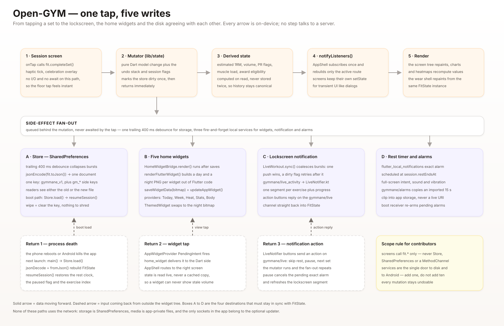
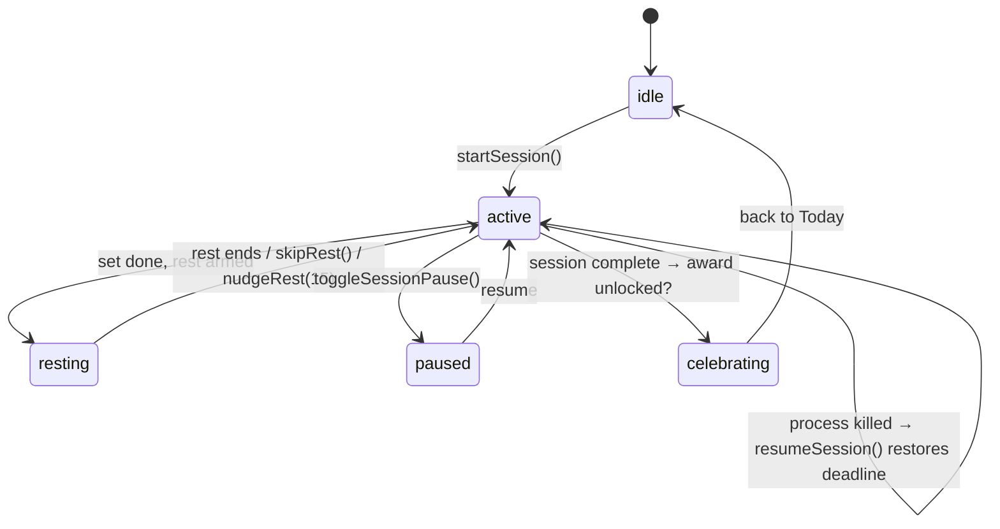
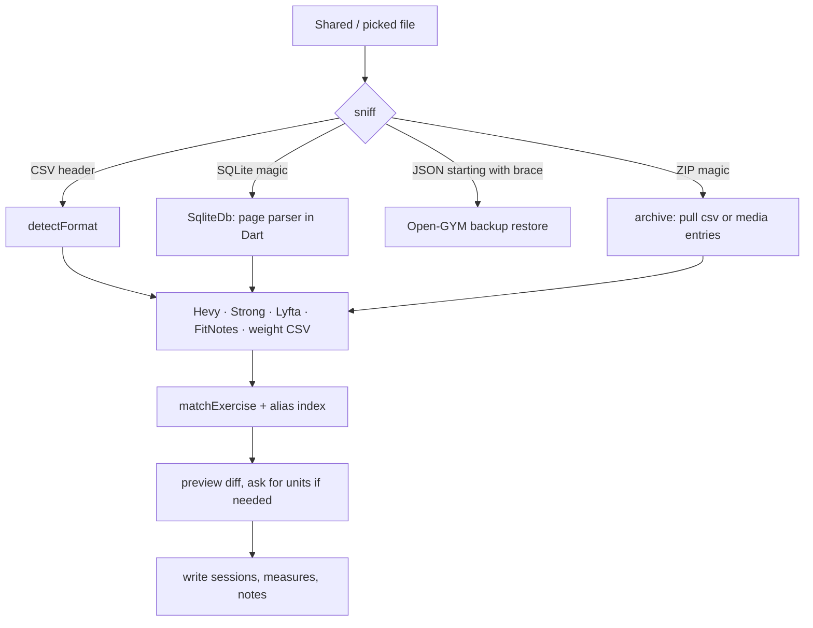
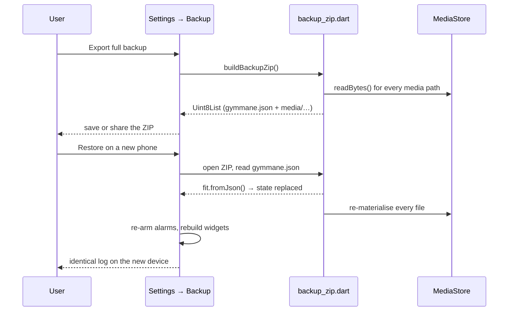

<div align="center">


<br/>


# Open-GYM

### Lift. Log it. Grow.
**A modern, offline, privacy-first gym & workout companion for Android.**  
*Tap your muscle on an interactive anatomical map, track your sets, watch your numbers climb.*

<br/>

<p>
  <a href="https://github.com/smartworldarafath/Open-GYM/releases"></a>
  <a href="https://flutter.dev"></a>
  <a href="https://kotlinlang.org"></a>
  <a href="LICENSE"></a>
  <a href="CREDITS.md"></a>
  <a href="https://github.com/smartworldarafath/Open-GYM/stargazers"></a>
</p>

<p>
  <a href="https://github.com/smartworldarafath/Open-GYM/releases"></a>
</p>

<sub><b>English</b> · <a href="docs/readme/README.es.md">Español</a> · <a href="docs/readme/README.it.md">Italiano</a> · <a href="docs/readme/README.zh.md">简体中文</a></sub>

<br/>
<br/>


<details>
<summary><sub><b>View In-App Screenshots (Direct Phone Captures)</b></sub></summary>
<br/>


<sub><b>Today</b> &nbsp;·&nbsp; <b>Body map</b> &nbsp;·&nbsp; <b>Live session</b> &nbsp;·&nbsp; <b>Progress</b></sub>

<br/>
<br/>


</details>

</div>

---

## Numbers that matter

| | | | |
| --- | --- | --- | --- |
| **552** built-in exercises | **28** screens | **508** passing tests | **16** languages |
| **43.5k** lines of Dart | **726** lines of Kotlin | **5** home widgets | **1** JSON file on disk |
| **9** ready-made programs | **20** medals to unlock | **13** muscle groups (front + back) | **0** accounts, **0** servers |

---

## Table of contents

1. [Why Open-GYM?](#-why-open-gym)
2. [Feature tour](#-feature-tour)
3. [How Open-GYM works](#-how-open-gym-works)
   - [3.1 The six layers](#31-the-six-layers)
   - [3.2 Boot sequence](#32-boot-sequence)
   - [3.3 The state layer](#33-the-state-layer)
   - [3.4 Navigation](#34-navigation)
   - [3.5 One tap, five writes](#35-one-tap-five-writes)
   - [3.6 The live session engine](#36-the-live-session-engine)
   - [3.7 Talking to Android](#37-talking-to-android)
   - [3.8 Home widgets pipeline](#38-home-widgets-pipeline)
   - [3.9 Imports and backups](#39-imports-and-backups)
4. [Data model](#-data-model)
5. [Project layout](#-project-layout)
6. [Tech stack](#-tech-stack)
7. [Testing](#-testing)
8. [Building from source](#-building-from-source)
9. [Internationalization](#-internationalization)
10. [Privacy in depth](#-privacy-in-depth)
11. [Roadmap and known limits](#-roadmap-and-known-limits)
12. [Contributing](#-contributing)
13. [License and credits](#-license--credits)

---

## ⚡ Why Open-GYM?

Most gym trackers are dashboards that demand an account, ship an ad SDK, and treat your body
metrics as somebody else's growth funnel. Open-GYM takes the opposite position: **your training
log is a local document that only ever lives on your phone.**

**Built for the gym floor**
Large tap targets, dark-mode-first contrast, haptic feedback on every set, and no step that needs
more than two taps while your hands are chalked and the bar is loaded.

**Survives the real world**
Kill the app mid-workout, reboot the phone, or let Android reap the process — the session, the
rest clock and the exercise index come back exactly where they were, because everything durable
is written to one JSON document on a debounce.

**Privacy you can verify, not just read about**
No sign-up, no server, no analytics SDK, no advertising identifier, no telemetry, and
`android:allowBackup="false"` so your log is not mirrored into an OS cloud backup either. The
architecture section below shows every path data can take — you can read all of it in this repo.

**Full vector art**
Every exercise animation, body map and medal is bundled vector/WebP/GLSL content. Nothing is
streamed, so the app looks identical with airplane mode on.

```
                        THE TRUST BOUNDARY
 ┌────────────────────────── phone (your data) ──────────────────────────┐
 │                                                                       │
 │   FitState ──► Store (SharedPreferences JSON) ──► app-private files   │
 │       │                              ▲                                │
 │       ├──► home widgets (bitmaps)    └── backup ZIP you export        │
 │       ├──► lockscreen notification                                   │
 │       └──► rest alarms (exact)                                        │
 │                                                                       │
 │   only one socket exists: the optional in-app updater, which talks    │
 │   to the GitHub releases API for THIS repository and nothing else     │
 └───────────────────────────────────────────────────────────────────────┘
                     ▲ no other egress path exists
```

> **Note on the `INTERNET` permission.** The manifest does declare `INTERNET` (plus
> `REQUEST_INSTALL_PACKAGES`): they exist so **Settings → About → Check for update** can query
> this repository's release feed, download an APK and hand it to the package installer. There is
> no analytics, no crash reporting, no ad mediation and no third-party domain in the app. If you
> build from source and delete `update_screen.dart` plus those two manifest lines, the binary has
> no network capability at all.

---

## 🚀 Feature tour

<table>
<tr>
<td width="50%" valign="top">

### Seamless training
- **Interactive anatomical body map** — tap a muscle on the front or back silhouette and the app
  builds a session from the 552-entry exercise catalog for that muscle and your available gear.
- **Precision logging** — reps, weight, RPE, RIR, warm-up sets, working sets, drop sets, failure
  sets, back-off sets, timed sets and per-set notes, with a full undo stack.
- **Rest timer that rings itself** — exact alarms with `+15 s` nudge, skip, pause, custom
  imported sound (capped at 15 s and copied into app storage), vibration and a full-screen
  intent so the bell fires even from the lock screen.
- **Lock-screen controls** — mark the set done, skip rest, pause or jump ahead from the
  media-style notification without unlocking the phone.
- **Supersets and circuits** — link consecutive exercises and skip the intermediate rests.
- **Places and gear** — home gym vs commercial gym presets, so the catalog only offers equipment
  you actually have.

</td>
<td width="50%" valign="top">

### Deep analytics and progress
- **Real progress curves** — Epley/McBradian estimated 1RM per set, volume over time, workout
  duration trends and weekly tonnage, all computed from your own history.
- **GitHub-style heatmap** — 84 or 182 day training grid with streak tracking.
- **Muscle split analysis** — 30 day anatomical workload distribution drawn on the same body map.
- **Body timeline** — bodyweight plus 10 circumferences with trend lines, and a progress-photo
  timeline kept in app-private storage with side-by-side comparison.
- **PRs and awards** — automatic personal records and 20 medals (streaks, tonnage, sets, hours,
  workouts) rendered as interactive medals through a GLSL shader.
- **Moments and share cards** — sticker-style share images generated entirely on device.

</td>
</tr>
<tr>
<td width="50%" valign="top">

### Exercise library and tools
- **552 exercises** with vector animation art, target muscles, equipment, difficulty and
  step-by-step technique text — all local, all searchable, in 16 languages.
- **Custom exercises** with your own demo GIF/video and per-exercise notes.
- **Nine ready-made programs** — beginner, intermediate and specialization templates you can
  import as routines in one tap.
- **Six calculators** — 1RM, plate maths with your own plate inventory, BMI, TDEE with macro
  split, Navy body-fat percentage and a warm-up ramp generator.
- **AI plan bridge** — generate a plan in any external assistant and import it through the
  clipboard: no model runs in the app and nothing is sent anywhere.
- **Five native home widgets** — Today, Week, Heatmap, Stats and Body, drawn by Flutter itself
  and pushed as day/night bitmaps.

</td>
<td width="50%" valign="top">

### Privacy and portability
- **One JSON document** — the entire app state is a single versioned key in
  `SharedPreferences`; media lives in app-private files.
- **Full ZIP backup** — one tap exports JSON plus every photo, video, note and sticker, and
  restores it losslessly.
- **Import from Hevy, Strong, Lyfta, FitNotes, CSV and SQLite dumps** — with alias matching that
  reconciles foreign exercise names against the local catalog before anything is written.
- **Wear OS** — the same APK boots a dedicated watch UI with rotary input.
- **16 languages** and light / OLED-dark / system themes with UI colour presets and custom
  background art.
- **One-tap wipe** — unrecoverable local deletion whenever you want.

</td>
</tr>
</table>

---

## 🧠 How Open-GYM works

The app is deliberately boring underneath: **Flutter UI on top of a single `ChangeNotifier`,
plain `SharedPreferences` underneath, and eight tiny Kotlin channels for the things Dart cannot
do.** No Bloc, no Riverpod, no SQLite, no code generation for state — one object (`fit`) owns
every value, screens read it, mutations notify, a debounce persists.



<sub><b>Source:</b> <code>assets/architecture/system-architecture.svg</code> — six stacked bands,
each one maps to a directory in <code>lib/</code> except the last two, which map to
<code>android/</code> and <code>.github/</code>.</sub>

### 3.1 The six layers

| Layer | Where | What lives there | Rule |
| --- | --- | --- | --- |
| **1 · Presentation** | `lib/app`, `lib/screens`, `lib/widgets` | `AppShell` (route switch), 28 screens, the theme system, 32 reusable widgets | Screens never touch disk or channels directly |
| **2 · State core** | `lib/state` | `FitState extends FitCore with 12 mixins`, the route stack, the save debounce | All mutations are methods on `fit`, all are undoable |
| **3 · Domain logic** | `lib/state/*_state.dart` + `lib/services` | live session engine, stats/PR/awards, six calculators, importers | Pure Dart, unit tested, no Android imports |
| **4 · Local data** | `services/local_store.dart`, `media_store.dart`, `alarm_store.dart` | one JSON document, app-private media files, imported alarm clips | One writer, versioned keys, migration on read |
| **5 · Platform bridges** | `lib/services` | 8 `gymmane/*` MethodChannels, `home_widget`, `flutter_local_notifications`, media packages | Channels are wrapped in a service, never called from a widget |
| **6 · Native Android** | `android/app/src/main` | `MainActivity.kt`, `LiveNotifier.kt`, 5 widget providers, `ThemedWidget.kt` (726 lines) | Kotlin only does what the OS requires |

The second surface (Wear OS) and the ship pipeline (CI) hang off the right column of the same
diagram: `main()` decides *before the engine boots* whether it is running on a watch, and CI is a
single workflow that is also the release button.

### 3.2 Boot sequence

```
main()  (lib/main.dart, 50 lines)
  │
  ├─ ensureInitialized()                    WidgetsFlutterBinding
  ├─ DeviceKind.isWatch() ? WearApp : GymMane
  │        └─ one shared FitState instance is constructed either way
  ├─ Store.instance.load()                  read gymmane_v1 (JSON) → fromJson()
  │        ├─ schema migrations run if the version moved
  │        └─ fit.resumeSession()           restore live session + rest deadline
  ├─ fit.bootstrap()                        reminders, widget refresh, theme warm-up
  └─ runApp(...)  →  AppShell
                        │
                        ├─ ListenableBuilder(listenable: fit)
                        ├─ switch (fit.route) → one screen
                        └─ PopScope guards a running session against back-swipe
```

Nothing awaits the network, so cold start is bounded by one `SharedPreferences` read and the
bundled asset manifest.

### 3.3 The state layer

`FitState` is one object assembled from **12 mixins in 14 files** (4,386 lines). Each mixin is a
slice of the domain, and each declares `on FitCore` plus whatever siblings it needs — so the
dependency graph is explicit in the type signature instead of in a wiring file.

```dart
class FitState extends FitCore
    with WorkoutState,      // live session, sets, rest, undo
          RoutinesState,    // plans, supersets, program templates
          StatsState,       // PRs, volume, streaks, heatmaps, radar
          ToolsState,       // six calculators, plate inventory
          LibraryState,     // custom exercises, notes, aliases
          TimelineState,    // body timeline, photos, measures
          MeasuresState,    // bodyweight + circumferences
          MomentsState,     // moments, stickers, share cards
          NotesState,       // journal entries
          PlacesState,      // gyms, equipment presets
          SettingsState,    // theme, colour, heat, alarm, language
          AwardsState {}    // 20 medals, unlock + celebration queue
```

| Mixin | File | Owns | Persisted as |
| --- | --- | --- | --- |
| `FitCore` | `fit_core.dart` | fields, `toJson`/`fromJson`, debounce, notify | `gymmane_v1` |
| `WorkoutState` | `workout_state.dart` | session, sets, rest clock, undo stack | `sessions[]`, `session` |
| `RoutinesState` | `routines_state.dart` | plans, linked sets, templates | `routines[]` |
| `StatsState` | `stats_state.dart` | PRs, volume, streaks, radar, heatmap | derived + `workouts[]` |
| `ToolsState` | `tools_state.dart` | calculators, plate inventory | `tools{}` |
| `LibraryState` | `library_state.dart` | custom exercises, aliases | `custom[]` |
| `TimelineState` / `MeasuresState` | `timeline_state.dart`, `measures_state.dart` | photos, bodyweight, girths | `timeline[]`, `measures[]` |
| `MomentsState` / `NotesState` / `PlacesState` | own files | moments, journal, gyms | `moments[]`, `notes[]`, `places[]` |
| `SettingsState` | `settings_state.dart` | theme, colour, alarm, units, language | `settings{}` |
| `AwardsState` | `awards_state.dart` | medal unlocks + celebration queue | `awards[]` |

Two conventions make this scale:

1. **Every mutation ends in `_save()`** — a trailing 400 ms debounce that serialises the whole
   document. Bursts of taps become one write.
2. **Every derived number is a getter** — `fit.weekVolume`, `fit.streak`, `fit.muscleLoad30d`
   are computed on read from `workouts[]`, never cached, so history can never drift out of sync.

### 3.4 Navigation

There is no `Navigator` push stack for the app's screens: `AppShell` is a `switch` over
`fit.route`, so **navigation is state** and survives process death like everything else.

| Route | Screen | Route | Screen |
| --- | --- | --- | --- |
| `home` | Today dashboard (default) | `timeline` | Body timeline |
| `progress` | Progress, heatmaps, PRs | `compare` | Side-by-side photos |
| `train` | Body map → build a session | `notes` / `note-edit` | Journal |
| `session` | Live workout (root, back-guarded) | `measures` | Body measurements |
| `exercises` / `exercise-detail` | Library | `places` | Gyms and gear |
| `routines` / `routine-edit` | Plans | `moments` | Moments and stickers |
| `tools` / `tools-detail` | Calculators | `awards` | Medal cabinet |
| `settings` / `preferences` | Settings | `about` | About, update, credits |
| `ai-plan` | Import an external plan | `profile` | Athlete profile |

- Bottom navigation is a fixed four: `home`, `progress`, `exercises`, `settings`.
- `pushRoute()` / `popRoute()` maintain a small `_routeStack` so back behaves like a stack while
  the widget tree stays a single switch.
- `PopScope` on the shell refuses to pop a running session; discarding asks for confirmation.



---

### 3.5 One tap, five writes

The single most important flow in the app: you tap a set, and four independent surfaces have to
agree — screen, disk, home widgets, lockscreen notification — plus a scheduled alarm.



<sub><b>Source:</b> <code>assets/architecture/data-flow.svg</code></sub>

```
                       tap a set
                          │
                          ▼
 ┌────────────────────────────────────────────────────────────────────┐
 │ FitState  (mutate → notify → schedule the fan-out)                 │
 └────────────────────────────────────────────────────────────────────┘
      │                │                │                │
      ▼                ▼                ▼                ▼
 ┌──────────┐    ┌────────────┐   ┌─────────────┐   ┌─────────────┐
 │  Store   │    │   5 home   │   │  lockscreen │   │ rest alarm  │
 │ debounce │    │  widgets   │   │ notification│   │ (exact, at  │
 │  400 ms  │    │ day + night│   │  segments   │   │  restEndsAt)│
 └──────────┘    └────────────┘   └─────────────┘   └─────────────┘
      │                │                │                │
      └────────────────┴────────────────┴────────────────┘
                             all local, all fire-and-forget
                             errors are caught and printed,
                             the tap itself never blocks
```

Properties worth keeping in mind when you change this path:

- **The tap never awaits I/O.** If a write fails the session still progresses; the next debounce
  retries.
- **`LiveWorkout.sync()` coalesces.** If a push is already in flight the new state is flagged
  dirty and pushed afterwards, so the notification can never be written out of order.
- **Notification actions come back into the same pipeline.** `LiveNotifier` buttons send
  `done / pause / add / skip / next` over `gymmane/live`, and the Dart handler calls
  `fit.toggleSet()`, `fit.skipRest()`, `fit.nudgeRest(15)`… — the exact same methods the UI uses.
- **Rest uses a deadline, not a counter.** `session.restEndsAt` is an absolute timestamp, so a
  killed process recomputes the remaining seconds instead of losing them.

### 3.6 The live session engine



Inside `workout_state.dart` the engine keeps:

| Concept | Representation |
| --- | --- |
| Working / warm-up / drop / failure / back-off / timed set | `kind` on `SetState`, rendered differently and excluded from volume maths where appropriate |
| Effort | `rpe` and `rir` per set, feeding RPE-aware progression |
| Superset / circuit | `linked` exercise ids; rest is skipped between linked members |
| Rest | absolute `restEndsAt` + `restSeconds`, armed once, cancelled on pause |
| Manual session | `manual: true` sessions skip the timer and reminder machinery |
| Elapsed time | `sessionElapsed` stored separately so pause does not inflate it |
| Undo | every destructive edit pushes onto an in-memory undo stack |

---

### 3.7 Talking to Android

Eight `gymmane/*` MethodChannels live in `MainActivity.kt` (235 lines); everything else is a
Dart package. Kotlin never holds business logic — it holds **capabilities**: vibration, wake
locks, notifications, share targets, the package installer.

| Channel | Direction | Method(s) | Why it needs Kotlin |
| --- | --- | --- | --- |
| `gymmane/haptics` | Dart → Kotlin | `buzz` | Waveform vibration that survives silent mode |
| `gymmane/screen` | Dart → Kotlin | `keepOn`, `dim` | Wake lock + screen dimming around a rest |
| `gymmane/device` | Dart → Kotlin | `isWatch` | Watch vs phone detection before UI boots |
| `gymmane/gallery` | Dart → Kotlin | `take`, `savePng` | Camera capture and MediaStore-safe saving |
| `gymmane/installer` | Dart → Kotlin | `install` | `ACTION_VIEW` through the app `FileProvider` |
| `gymmane/live` | Both ways | `update`, `end` → `action` | Build the media-style notification, receive its buttons |
| `gymmane/incoming` | Kotlin → Dart | `incoming` | Text shared into the app (external plan paste) |
| `gymmane/rotary` | Kotlin → Dart | `scroll` | Wear OS encoder ticks on the watch bezel |

A ninth channel, `gymmane/live_activity`, is declared in Dart for iOS Live Activities and is a
no-op on Android (the code branches on `Platform.isIOS`).

```
   Dart services (lib/services)                 Kotlin (android/app/src/main)
 ┌──────────────────────────────┐              ┌────────────────────────────────┐
 │ rest_alarm.dart  'buzz'      │─────────────►│ MainActivity  vibration        │
 │ screen_awake.dart 'keepOn'   │─────────────►│ MainActivity  wake lock        │
 │ device_kind.dart 'isWatch'   │─────────────►│ MainActivity  Configuration    │
 │ gallery.dart     'take'      │─────────────►│ MainActivity  camera/gallery   │
 │ installer.dart   'install'   │─────────────►│ MainActivity  FileProvider     │
 │ live_workout.dart 'update'   │─────────────►│ LiveNotifier  notification     │
 │                          'action' ◄─────────│ LiveNotifier  button presses   │
 │ incoming_share  'incoming'   ◄──────────────│ MainActivity  SEND intent      │
 │ wear shell       'scroll'    ◄──────────────│ MainActivity  rotary listeners │
 └──────────────────────────────┘              └────────────────────────────────┘
```

`LiveNotifier.kt` (269 lines) is the only file with real behaviour: it owns the notification
channel, draws the media-style head with `RemoteViews`, paints one progress segment per
exercise, flashes the `+15 s` chip on a timed tick, and routes its action buttons back to Dart
through `LiveNotifier.dart` — which is set to the same `gymmane/live` channel on engine attach and
nulled on detach.

### 3.8 Home widgets pipeline

Home screen widgets cannot run Flutter, so the trick is: **render them in Flutter, ship them as
bitmaps.**

```
 FitState changes
      │
      ▼
 HomeWidgetBridge.render()          lib/services/home_widget_bridge.dart
      │  for each widget, day and night pass:
      ▼
 build a tiny Flutter tree (CustomPainter or WebView → snapshot)
      │
      ▼
 HomeWidget.renderFlutterWidget(view, key, pixelRatio: 3)   → PNG in app storage
      │
      ▼
 HomeWidget.saveWidgetData<String>(key, path)
 HomeWidget.saveWidgetData<String>(key + '_night', path)
      │        plus scalar data: today_stamp, today_week, week_done,
      │        week_ring, week_ring_night, week_start, widget_theme, widget_dark
      ▼
 HomeWidget.updateWidget()  →  AppWidgetProvider.updateAppWidget(...)   (Kotlin)
      │
      ▼
 ThemedWidget: reads widget_dark / widget_theme and picks the night bitmap,
               so the widget repaints itself at the OS level at midnight
```

Five providers ship: `TodayWidgetProvider`, `WeekWidgetProvider`, `HeatmapWidgetProvider`,
`StatsWidgetProvider` and `BodyWidgetProvider` (21–50 lines each), all delegating to the shared
`ThemedWidget` (79 lines). A widget tap travels back through a `PendingIntent` → `home_widget` →
`AppShell`, which routes to the screen that can act on it.

---

### 3.9 Imports and backups

Three separate pipelines, all pure Dart, all unit tested against **real exported files** that
live in `test/`:



**`detectFormat()` reads the header row, not the file name** — `exercise_title` + `start_time`
is Hevy, `exercise name` + `set order` is Strong, a `rir/rpe` or `recordlevel*` column is Lyfta,
the FitNotes shape is the fallback, and anything under three columns is treated as a weight-only
CSV. Your own export is recognised first by its JSON body.

**Alias matching (`exercise_match.dart`)** builds a normalised index over
`exercise_aliases.dart` (hundreds of names across languages and app conventions) and scores the
catalog against it, so `Bench Press (Barbell)` from Hevy lands on *Barbell Bench Press* instead
of silently creating a duplicate.

**Round-trip ZIP backup (`backup_zip.dart`)** is the safety net that makes the JSON store
approachable — one file in, one file out, no server:

```
my-backup-2026-09-25.zip
├── gymmane.json              ← the complete state document (media maps embedded)
├── media/
│   ├── images/               ← exercise demo photos/GIFs
│   ├── videos/               ← exercise demo videos
│   └── notes/                ← journal attachments
├── timeline/2026-09-18/      ← progress shots, grouped by day and pose
├── moments/                  ← moment clips
└── alarm/                    ← imported rest-alarm sounds (15 s max)
```

Restoring rewrites the whole document, re-materialises every file into app storage and re-arms
alarms. Because `android:allowBackup="false"`, **this ZIP is the only complete backup that
exists** — export before switching phones.



---

### 3.10 Wear OS

Wear support is a **second root widget, not a second app**. `main()` asks
`DeviceKind.isWatch()` over `gymmane/device` before anything is built and calls `runApp(WearApp)`
instead of `runApp(GymMane)`. Same APK, same `FitState`, same store — only the chrome differs.

```dart
// lib/main.dart
Future<void> main() async {
  WidgetsFlutterBinding.ensureInitialized();
  final watch = await DeviceKind.isWatch();
  runApp(watch ? const WearApp() : const GymMane());
}
```

`lib/wear/wear_shell.dart` (1,152 lines) draws a round-friendly pager: clock home with a
`_WeekRing` progress painter, routines, live session controls, awards and settings. Input comes
from three sources — `GestureDetector` taps/swipes, the `flutter_wear_input` package, and
`gymmane/rotary` encoder events that MainActivity converts from `MotionEvent` axis scrolls into
`invokeMethod('scroll', …)`. `wear_test.dart` covers the ring maths and pager behaviour.

> Android Wear OS shows `uses-feature android.hardware.type.watch` as optional in the manifest,
> so the same universal APK installs on phone and watch.

---

## 🗄 Data model

Everything is one document under the SharedPreferences key **`gymmane_v1`**, plus a handful of
`gm_*` side keys for small non-serialised preferences (widget paths, last update check).

```jsonc
{
  "v": 1,                      // schema version → migrations run on read
  "unit": "kg",                // kg / lb
  "settings": { "theme": "dark", "heat": 2, "alarm": "rest", "lang": "en" },
  "profile": { "name": "", "height": 178, "birth": 1996 },
  "workouts": [ { "date": "2026-09-18", "exercises": [ … ], "duration": 3720 } ],
  "session": {                 // present only while a workout is live
    "index": 2, "restEndsAt": 1790000000000, "paused": false, "elapsed": 840
  },
  "routines":   [ … ],         // plans, linked/superset groups, day templates
  "custom":     [ … ],         // user-defined exercises (media paths inside)
  "measures":   [ … ],         // bodyweight + circumferences
  "timeline":   [ … ],         // progress shots by day/pose
  "notes":      [ … ],         // journal entries + attachments
  "moments":    [ … ],         // moments and stickers
  "places":     [ … ],         // gyms and gear presets
  "tools":      { "plates": […], "oneRm": … },
  "awards":     [ "firstStep", "streak7" … ],   // unlocked medal ids
  "media":      { "<path>": "media/images/x.gif" }   // added only by ZIP export
}
```

| Surface | Representation | Why |
| --- | --- | --- |
| Whole log | one JSON string | one writer, one reader, no migration fan-out |
| Media | opaque paths in app-private storage | files are never base64'd into the document |
| Timestamps | epoch ms | deadlines (`restEndsAt`) survive reboot |
| History | `workouts[]` append | derived stats are pure functions over it |
| Aliases | `exercise_aliases.dart` (code, not data) | alias rules ship with tests and translations |

Debounced write path: `fit.anyMutation() → _save() → 400 ms timer → Store.save(toJson())`.
Reads happen once at boot; everything else lives in memory.

---

## 📁 Project layout

```
Open-GYM/
├── android/                      # native layer: Kotlin, manifest, Gradle
│   └── app/src/main/kotlin/com/opengym/app/
│       ├── MainActivity.kt       # 235 · 8 channels, rotary, intents, installer
│       ├── LiveNotifier.kt       # 269 · lockscreen notification + actions
│       ├── ThemedWidget.kt       #  79 · day/night bitmap chooser
│       └── *WidgetProvider.kt    #  21–50 × 5 · Today, Week, Heat, Stats, Body
├── assets/
│   ├── art/                      # 302 vector exercise animations (SVG)
│   ├── badges/                   # 40 medal images (on / off / spin frames)
│   ├── shaders/                  # medal.frag, edge_fade.frag (GLSL)
│   ├── audio/ fonts/ img/ icon/  # default alarm, Nunito, art
│   └── architecture/             # the two diagrams used in this README
├── lib/
│   ├── main.dart                 #   50 · watch or phone, then store load
│   ├── app/                      #  724 · AppShell switch + bottom nav
│   ├── screens/                  # 15,753 across 28 screens
│   ├── widgets/                  #  7,788 across 32 widgets
│   ├── state/                    #  4,386 · FitState + 12 mixins (14 files)
│   ├── services/                 #  2,793 across 19 services
│   ├── catalog/                  #  9,861 · 552 exercises, aliases, programs
│   ├── models/                   #    668 · 8 value models
│   ├── theme/                    #    310 · light / OLED dark / system
│   ├── wear/                     #  1,202 · WearApp + WearShell
│   └── l10n/                     # 16 ARB locales (68,320 lines of text)
├── test/                         # 53 files, 508 tests
├── docs/                         # screenshots + translated READMEs
├── fastlane/                     # store metadata
├── crowdin.yml / l10n.yaml       # translation pipeline
└── .github/workflows/build-apk.yml   # analyze → test → APK → release
```

| Area | Files | Lines | Share of hand-written code |
| --- | ---: | ---: | ---: |
| Screens | 28 | 15,753 | 36 % |
| Widgets | 32 | 7,788 | 18 % |
| State core | 14 | 4,386 | 10 % |
| Services | 19 | 2,793 | 6 % |
| Catalog + models + theme + app + main | 27 | 11,613 | 27 % |
| Wear shell | 2 | 1,202 | 3 % |
| **Total Dart (excluding generated l10n)** | **~140** | **43,535** | 100 % |
| Kotlin | 8 | 726 | — |
| Tests | 53 | (508 test cases) | — |

---

## 🛠 Tech stack

| Concern | Choice | Note |
| --- | --- | --- |
| Framework | **Flutter 3.41.9** (Dart SDK `^3.11.5`) | the exact CI pin that F-Droid's recipe reads |
| State | **`ChangeNotifier` + mixins** | no Bloc, no Riverpod, no Provider — one `fit` object |
| Navigation | `switch (fit.route)` + `_routeStack` | no `go_router`, navigation survives process death |
| Persistence | **`shared_preferences`** single JSON | no SQLite plugin, no ORM, no codegen |
| Native channels | hand-written `gymmane/*` (8) | only where Dart genuinely cannot go |
| Notifications | `flutter_local_notifications` + `timezone` | exact alarms, full-screen intent, actions |
| Home widgets | `home_widget` | Flutter-rendered bitmaps, day + night |
| Media | `image_picker`, `video_player`, `audioplayers`, `file_picker` | demo media, alarm sounds |
| Sharing | `share_plus`, `path_drawing`, `phosphoricons_flutter` | share cards, calendar path animation |
| Settings deep links | `app_settings`, `url_launcher` | jump to the OS permission screens |
| Archives | `archive` | backup ZIP + Strong weight CSV |
| Localisation | `flutter gen_l10n` (`generate: true`) + `intl` | 16 ARB locales, Crowdin configured |
| Shaders | GLSL (`medal.frag`, `edge_fade.frag`) | medal shimmer and edge fade |

**Deliberately absent:** HTTP/DIO clients, Firebase, analytics/crash SDKs, ad SDKs, a local
database plugin, and any code generation beyond `flutter gen_l10n`. Fewer dependencies means the
attack surface and the build breakage surface both stay small.

---

## 🧪 Testing

The suite runs on every pull request: **53 test files, 508 test cases, no network, no mocks of
the store.**

| Suite | Cases | What it pins down |
| --- | ---: | --- |
| `reddit_requests_test` / `requests_18sep_test` / `requests_19sep_test` | 78 | regression replays of real issue-tracker reports |
| `import_test` + `import_real_files_test` | 31 | Hevy, Strong, Lyfta, FitNotes and weight CSVs parsed from **actual exports** in `test/` |
| `i18n_test` | 29 | every ARB key present in all 16 locales, placeholders balanced |
| `set_kinds_test` + `editing_test` | 28 | warm-up / drop / failure / back-off / timed maths and edit flows |
| `calculators_test` + `units_test` | 27 | 1RM, plate maths, BMI, TDEE, Navy, warm-up ramp, kg/lb round trips |
| `backup_zip_test` + `backup_complete_test` | 18 | ZIP round trip, embedded media maps, lossless restore |
| `persistence_test` + `session_test` + `live_session_test` | 31 | `toJson`/`fromJson` golden records, session state machine, rest deadlines |
| `catalog_test` + `muscle_map_test` + `body_hit_test` | 18 | 552 exercises unique and complete, 13 muscle targets, hit-test regions |
| `wear_test` + `route_stack_test` + `home_widgets_test` | 19 | watch pager/ring maths, navigation stack, widget payloads |
| `gamification_test` + `timeline_test` + `stats_realdata_test` | 29 | medal unlocks, body timeline, stats against real data |

Two of these files double as a **format specification**: the golden JSON expectations in
`persistence_test.dart` and the ZIP entries asserted in `backup_zip_test.dart` are what a future
refactor must not break — if they change, backups in the wild stop restoring.

```bash
flutter analyze --no-fatal-infos   # lints, never blocks on info-level notes
flutter test                       # 508 tests, typically well under a minute
```

---

## 📦 Building from source

### Prerequisites

- **Flutter 3.41.x (stable)** — the version pinned by CI and read by the F-Droid recipe
- **JDK 17** (CI uses Temurin 17)
- **Android SDK** with `compileSdk 36`, `buildTools 36.0.0`, `minSdk 24`
- A device or emulator running Android 7.0+

### Build steps

```bash
git clone https://github.com/smartworldarafath/Open-GYM.git
cd Open-GYM
flutter pub get
flutter test        # optional, but it is what CI does
flutter run --release
```

The release APK is written to `build/app/outputs/flutter-apk/app-release.apk`.

### Producing distributable APKs

```bash
flutter build apk --release                 # universal APK
flutter build apk --release --split-per-abi # per-ABI APKs
```

CI renames them to `Open-GYM-universal.apk`, `Open-GYM-arm64-v8a.apk`,
`Open-GYM-armeabi-v7a.apk` and `Open-GYM-x86_64.apk`, and uploads them as the `open-gym-apks`
artifact.

> **versionCode rule:** split APKs override the base code as `base * 10 + abiIndex`
> (`android/app/build.gradle.kts`), so Play/package managers can distinguish the ABI builds
> without stepping on each other.

### How releases are made

One workflow does everything — `.github/workflows/build-apk.yml`:

| Trigger | What runs |
| --- | --- |
| **Pull request to `main`** | `flutter analyze` → `flutter test` → universal + split APKs → upload artifact |
| **Manual dispatch with a `tag` input** | same build, plus keystore from repo secrets (`KEYSTORE_BASE64`, …), `--split-debug-info` symbols kept in `build/symbols`, then `softprops/action-gh-release` publishes the four APKs to a GitHub Release |

The Flutter version is defined **once** (`env: FLUTTER_VERSION: '3.41.9'`) precisely so the
F-Droid recipe can extract the same value — bump it in one place and both builds follow.

---

## 🌍 Internationalization

Sixteen locales ship from `lib/l10n/*.arb`, generated by `flutter gen_l10n`
(`l10n.yaml`, template `app_en.arb`, class `AppLocalizations`, `nullable-getter: false` — so
missing keys fail fast instead of rendering `null` on a gym floor):

| | | | |
| --- | --- | --- | --- |
| English (default) | Español | Italiano | 简体中文 |
| 繁體中文 | Deutsch | Français | Português |
| Nederlands | Polski | Русский | Українська |
| Türkçe | 日本語 | 한국어 | العربية |

- `crowdin.yml` wires the translation pipeline; `TRANSLATING.md` explains how to add a language.
- `i18n_test.dart` (29 cases) asserts key parity and placeholder balance across all 16 files.
- The README exists in four languages: [Español](docs/readme/README.es.md),
  [Italiano](docs/readme/README.it.md), [简体中文](docs/readme/README.zh.md).
- Right-to-left layouts (Arabic) and non-Latin scripts are handled by the layout, not by
  hard-coded pixel offsets.

---

## 🔒 Privacy in depth

Everything below is verifiable in `android/app/src/main/AndroidManifest.xml` and `lib/`.

| Permission | Why it exists |
| --- | --- |
| `POST_NOTIFICATIONS` | the rest alarm and the live-workout notification |
| `POST_PROMOTED_NOTIFICATIONS` | keeps the workout visible in the promoted slot on new Android versions |
| `USE_EXACT_ALARM` / `SCHEDULE_EXACT_ALARM` | the rest bell must fire on the second |
| `USE_FULL_SCREEN_INTENT` | the bell rings over the lock screen while your phone is face down |
| `RECEIVE_BOOT_COMPLETED` | pending alarms are re-armed after a reboot |
| `WAKE_LOCK` | `gymmane/screen` keeps the display alive during a set, dims between them |
| `VIBRATE` | `gymmane/haptics` waveform when the app is open and silent mode is on |
| `WRITE_EXTERNAL_STORAGE` (`maxSdkVersion="28"`) | legacy export to Downloads on Android 9 and below |
| `INTERNET` | **only** the in-app updater, see [Why Open-GYM?](#-why-open-gym) |
| `REQUEST_INSTALL_PACKAGES` | **only** the in-app updater handing the APK to the installer |

Additional facts worth stating plainly:

- `android:allowBackup="false"` — no OS cloud backup mirror of your log.
- No `AccountManager`, no `RECORD_AUDIO`, no location, no contacts, no advertising ID.
- Media is read through `MediaStore`/pickers and written to app-private storage; the app never
  scans other apps' files.
- The app can be wiped from Settings in one tap; because the store is a single key, wiping is
  genuinely complete.
- `com.google.android.wearable.standalone` is declared so the watch install needs no phone
  companion permission.

---

## 🧭 Roadmap and known limits

An honest list — the goal is a correct tool, not a feature checklist:

**Known limits**
- **Android only.** Dart has `Platform.isIOS` branches (the Live Activity channel), but there is
  no `ios/` project in the repository, so iOS builds are not supported today.
- **No automatic off-device backup by design.** You must export the ZIP yourself; nothing syncs
  in the background.
- **No cloud social features** — no friends, no leaderboard, no shared plans. Plans travel by
  clipboard/ZIP instead (`plan_share.dart`, `incoming_share.dart`).
- **Home widgets are snapshots**, updated whenever state changes and at midnight; they are not
  live views.
- **Catalog scope** is 552 exercises with hand-drawn vector art; exotic lifts are added through
  catalog PRs, not scraped.

**Planned / welcome**
- More program templates and progression schemes on top of the nine built-ins.
- Richer Wear OS logging (today it is strongest as a controller for the phone session).
- Additional importers behind the same `detectFormat()` shape.
- More locales — every new ARB file is a one-pull-request contribution.
- Optional: CSV/columnar export alongside the existing JSON+ZIP and per-workout CSV export.

---

## 🤝 Contributing

Contributions are what make the open-source community such an amazing place to learn, inspire,
and create. Any contributions you make are **greatly appreciated**.

**First, read [`CONTRIBUTING.md`](CONTRIBUTING.md)** — it carries the full checklist (tests, no
generated l10n churn, asset rules, commit style).

Good first contributions, in rough order of value:

| Area | What to do | Where |
| --- | --- | --- |
| Translations | add or improve an ARB locale | `lib/l10n/app_*.arb`, [`TRANSLATING.md`](TRANSLATING.md) |
| Exercises | new catalog entries with art and technique text | `lib/catalog/exercise_catalog.dart`, `assets/art/` |
| Imports | support another app's export shape in `detectFormat()` | `lib/services/workout_import.dart` + a real fixture in `test/` |
| Reports | bug reports with steps, log lines and a redacted backup ZIP | GitHub Issues |
| Code | screens, widgets, services, Wear OS | see the architecture section above for the rules |

Before you push:

```bash
flutter analyze --no-fatal-infos
flutter test          # 508 tests must stay green
```

Architecture rules that reviewers will hold you to:

1. Screens call `fit.*` — never `Store`, `SharedPreferences` or a `MethodChannel` directly.
2. New domain behaviour gets a mixin + a test, not a package.
3. Anything that must survive a process kill belongs in `toJson()`/`fromJson()`.
4. Keep the dependency list flat: adding a package needs a justification in the PR.

---

## 📄 License & Credits

- **Code**: Licensed under the **[GNU General Public License v3.0 (GPL-3.0)](LICENSE)**.
- **Exercise Illustrations**: Sourced from [Workout Guide](https://github.com/bryllim/workout-guide) by **Bryl Lim**, based on [Everkinetic](https://github.com/everkinetic/data), under **[CC BY-SA 4.0](https://creativecommons.org/licenses/by-sa/4.0/)**.
- **Typography**: [Nunito Font](https://github.com/googlefonts/nunito) under the **SIL Open Font License**.
- Detailed attribution notes are documented in **[CREDITS.md](CREDITS.md)**.
