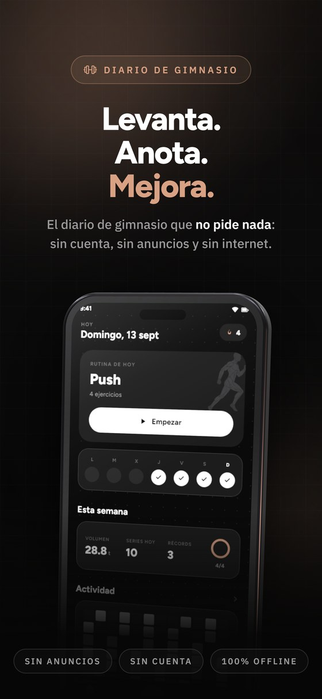
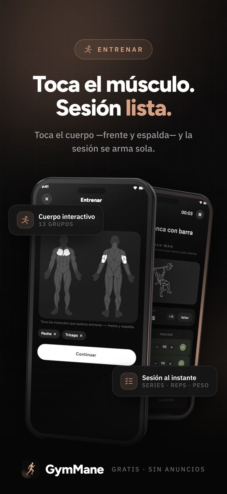
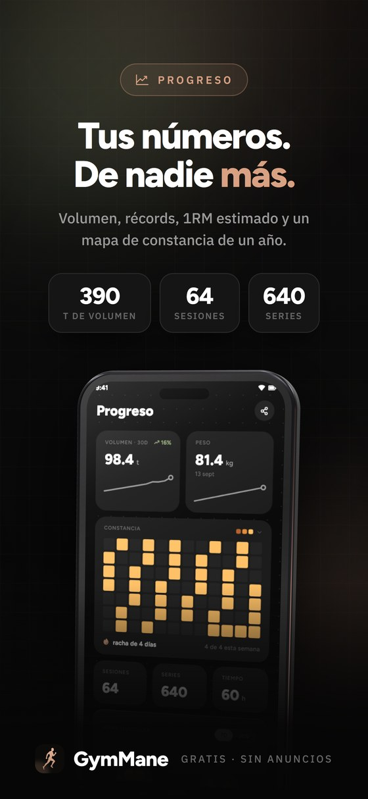
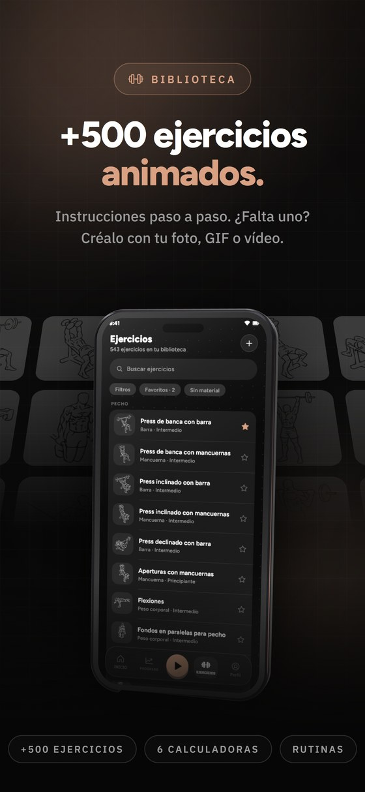

<div align="center">


<br/>


# GymMane

Un diario de gimnasio gratis y sin conexión para Android.<br/>
Toca los músculos que quieres entrenar, apunta tus series y mira cómo suben tus números.

<br/>

<p>
  
  
  
  <a href="https://github.com/smartworldarafath/Open-GYM/stargazers"></a>
</p>

<p>
  <a href="https://trendshift.io/repositories/107197?utm_source=trendshift-badge&amp;utm_medium=badge&amp;utm_campaign=badge-trendshift-107197" target="_blank" rel="noopener noreferrer"></a>
</p>

<a href="https://f-droid.org/packages/com.gymmane.app/"></a>
&nbsp;
<a href="https://apt.izzysoft.de/fdroid/index/apk/com.gymmane.app?repo=main"></a>
&nbsp;
<a href="https://www.openapk.net/gymmane/com.gymmane.app/"></a>
&nbsp;
<a href="https://github.com/smartworldarafath/Open-GYM/releases"></a>
&nbsp;
<a href="https://apps.obtainium.imranr.dev/redirect?r=obtainium://app/%7B%22id%22%3A%22com.gymmane.app%22%2C%22url%22%3A%22https%3A%2F%2Fgithub.com%2FArafath%2FGymMane%22%2C%22author%22%3A%22Arafath%22%2C%22name%22%3A%22GymMane%22%2C%22preferredApkIndex%22%3A0%2C%22additionalSettings%22%3A%22%7B%5C%22includePrereleases%5C%22%3Afalse%2C%5C%22fallbackToOlderReleases%5C%22%3Atrue%2C%5C%22filterReleaseTitlesByRegEx%5C%22%3A%5C%22%5C%22%2C%5C%22filterReleaseNotesByRegEx%5C%22%3A%5C%22%5C%22%2C%5C%22verifyLatestTag%5C%22%3Afalse%2C%5C%22dontSortReleasesList%5C%22%3Afalse%2C%5C%22useLatestAssetDateAsReleaseDate%5C%22%3Afalse%2C%5C%22trackOnly%5C%22%3Afalse%2C%5C%22versionExtractionRegEx%5C%22%3A%5C%22%5C%22%2C%5C%22matchGroupToUse%5C%22%3A%5C%22%5C%22%2C%5C%22versionDetection%5C%22%3Atrue%2C%5C%22releaseDateAsVersion%5C%22%3Afalse%2C%5C%22useVersionCodeAsOSVersion%5C%22%3Afalse%2C%5C%22apkFilterRegEx%5C%22%3A%5C%22%5C%22%2C%5C%22invertAPKFilter%5C%22%3Afalse%2C%5C%22autoApkFilterByArch%5C%22%3Atrue%2C%5C%22appName%5C%22%3A%5C%22%5C%22%2C%5C%22shizukuPretendToBeGooglePlay%5C%22%3Afalse%2C%5C%22allowInsecure%5C%22%3Afalse%2C%5C%22exemptFromBackgroundUpdates%5C%22%3Afalse%2C%5C%22skipUpdateNotifications%5C%22%3Afalse%2C%5C%22about%5C%22%3A%5C%22GymMane%20is%20an%20open%20source%20gym%20log%20for%20Android.%20Pick%20your%20muscles%20on%20a%20body%20map%2C%20log%20your%20sets%2C%20and%20watch%20your%20numbers%20grow.%20No%20accounts%2C%20no%20ads%2C%20no%20tracking%2C%20no%20internet%20permission.%5C%22%7D%22%2C%22overrideSource%22%3Anull%7D"></a>

<sub><a href="../../README.md">English</a> · <b>Español</b> · <a href="README.it.md">Italiano</a> · <a href="README.zh.md">简体中文</a></sub>

<br/>
<br/>









<details>
<summary><sub><b>Capturas sin retoques</b>, todas las pantallas sacadas del móvil</sub></summary>
<br/>


<sub><b>Inicio</b> &nbsp;·&nbsp; <b>Mapa del cuerpo</b> &nbsp;·&nbsp; <b>Sesión en directo</b> &nbsp;·&nbsp; <b>Progreso</b></sub>

<br/>
<br/>


<sub><b>Historial</b> &nbsp;·&nbsp; <b>Biblioteca</b> &nbsp;·&nbsp; <b>Rutinas</b> &nbsp;·&nbsp; <b>Ajustes</b></sub>

</details>

</div>

## Qué hace

<table>
<tr>
<td width="50%" valign="top">

### Entreno

- **Mapa del cuerpo**, de frente y de espalda: toca lo que quieres entrenar
- Reps, peso y un **temporizador de descanso** con tu propio sonido de alarma
- **Tipos de serie** (calentamiento, efectiva, drop set, al fallo) y RPE o RIR
- **Superseries**: enlaza un ejercicio con el siguiente y sáltate el descanso
- **Discos por lado**, calculados con el material que tienes
- **Rutinas** que puedes agrupar, duplicar y programar, y planes ya hechos
- Una **notificación en vivo** con la cuenta atrás del descanso, y una sesión
  que sobrevive a un reinicio

</td>
<td width="50%" valign="top">

### Progreso

- Volumen, racha, meta semanal y **récords**, todo con tus propias series
- Un **mapa de actividad**, tu ritmo semanal y los totales de siempre
- **Curvas de fuerza** con 1RM estimado, y tu reparto muscular
- **Fotos de progreso** en una línea de tiempo, o la misma línea dibujada
  sobre el mapa muscular
- Peso corporal y **diez medidas**, cada una con su curva
- Un **perfil** con niveles y **20 medallas**
- Pon tu entreno sobre una foto como **pegatina** y compártelo

</td>
</tr>
<tr>
<td width="50%" valign="top">

### Ejercicios y herramientas

- **Más de 500 ejercicios** con animación e instrucciones paso a paso
- Filtros por músculo, material y nivel, y **tus propios ejercicios**
- Cambia el dibujo de cualquier ejercicio por **tu foto, GIF o vídeo**
- **Sitios**: dile qué material tienes y solo te ofrece lo que encaja
- Un **diario de entreno** en un calendario, con fotos y vídeo
- **Seis calculadoras**: 1RM, discos, IMC, calorías y macros, grasa corporal
  y calentamiento
- **Cinco widgets**: hoy, esta semana, actividad, estadísticas y mapa muscular

</td>
<td width="50%" valign="top">

### Tus datos

- Exporta a **CSV** o a una **copia ZIP** completa, con fotos y vídeos, y
  vuelve a importarla
- Trae tu historial de **Hevy**, **Strong**, **Lyfta**, **FitNotes**,
  **openGym** o cualquier CSV
- **Rutina con IA**: exporta tu lista, pégala donde quieras e importa la
  respuesta
- Sin cuenta, sin anuncios, sin analítica y sin **permiso de internet**
- Fotos, vídeos y notas se quedan en el almacenamiento de la app
- **16 idiomas**, tema claro y oscuro, kg o lb
- Bórralo todo de un toque

</td>
</tr>
</table>

## Descarga

Descárgala desde F-Droid, IzzyOnDroid, OpenAPK, Obtainium o las
[releases de GitHub](https://github.com/smartworldarafath/Open-GYM/releases/latest). En GitHub, si no
sabes qué APK elegir, coge el `arm64-v8a`.

| Plataforma | Estado |
|---|---|
| Android 7.0+ | Disponible |
| Wear OS 3+ | En desarrollo |
| iOS 15+ | En desarrollo |
| Escritorio | Planeado |

## Privacidad

Sin cuenta, sin anuncios y sin analítica. GymMane ni siquiera tiene permiso de
internet, así que tus entrenos se quedan en tu móvil. Los permisos que pide son
para el temporizador de descanso, su notificación y los widgets.

## Colaborar

Los reportes de fallos, las ideas y los pull requests son bienvenidos. Para
algo grande, abre antes una incidencia. Las traducciones son ficheros de texto
en [lib/l10n](../../lib/l10n), y **TRANSLATING.md** explica cómo añadir una.

```bash
git clone https://github.com/smartworldarafath/Open-GYM.git
cd GymMane
flutter pub get
flutter build apk --release
```

## Apoyo

GymMane es gratis y lo seguirá siendo. Una estrella, una traducción o un buen
reporte de fallo ayudan mucho. Si quieres invitarme a un café:

<div align="center">

<a href="https://github.com/smartworldarafath"></a>

<table align="center">
  <tr>
    <td align="center" width="130"><br/><sub><b>Bitcoin</b></sub></td>
    <td><code>bc1qm0r4pg8nknnjh3a7n2t63ckafhsz8jdd6qer29</code></td>
  </tr>
  <tr>
    <td align="center" width="130"><br/><sub><b>Ethereum</b></sub></td>
    <td><code>0x34b7A5552132cBca150Ae29c1E632faA49430e1a</code></td>
  </tr>
  <tr>
    <td align="center" width="130"><br/><sub><b>Solana</b></sub></td>
    <td><code>DC8dNEUNJhWdtBHBZAn4FTheVC3W4PtkGhbazvtk17Jo</code></td>
  </tr>
  <tr>
    <td align="center" width="130"><br/><sub><b>Monero</b></sub></td>
    <td><code>44SECMEf3rfV228kpy3Gs48wLmLXnq231gAMG7ULYoCWBWLYLHdwYV7YFkhMk31DR5P7SRAyRPyhkYaehtgEoajASz7qubq</code></td>
  </tr>
</table>

</div>

## Licencia

El código es [GPL-3.0](../../LICENSE). El arte de los ejercicios viene de
[Workout Guide](https://github.com/bryllim/workout-guide) de Bryl Lim, basado en
[Everkinetic](https://github.com/everkinetic/data), y es
[CC BY-SA 4.0](https://creativecommons.org/licenses/by-sa/4.0/). Las fuentes usan la SIL Open
Font License. **CREDITS.md** tiene los detalles.

## Historial de estrellas

<a href="https://www.star-history.com/?repos=smartworldarafath%2Fgymmane&type=date&legend=top-left">
 <picture>
   <source media="(prefers-color-scheme: dark)" srcset="https://api.star-history.com/chart?repos=smartworldarafath/Open-GYM&type=date&theme=dark&legend=top-left" />
   <source media="(prefers-color-scheme: light)" srcset="https://api.star-history.com/chart?repos=smartworldarafath/Open-GYM&type=date&legend=top-left" />
   
 </picture>
</a>
