<div align="center">

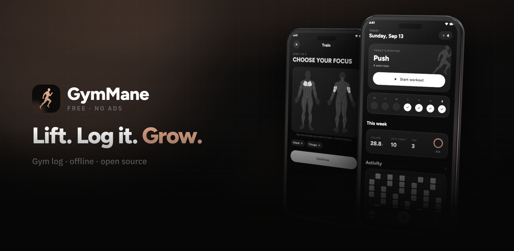

<br/>


# GymMane

Un diario da palestra gratuito e offline per Android.<br/>
Tocca i muscoli che vuoi allenare, registra le serie e guarda crescere i tuoi numeri.

<br/>

<p>
  
  
  
  <a href="https://github.com/smartworldarafath/Open-GYM/stargazers"></a>
</p>

<p>
  <a href="https://trendshift.io/repositories/107197?utm_source=trendshift-badge&amp;utm_medium=badge&amp;utm_campaign=badge-trendshift-107197" target="_blank" rel="noopener noreferrer"></a>
</p>

<a href="https://f-droid.org/packages/com.opengym.app/"></a>
&nbsp;
<a href="https://apt.izzysoft.de/fdroid/index/apk/com.opengym.app?repo=main"></a>
&nbsp;
<a href="https://www.openapk.net/gymmane/com.opengym.app/">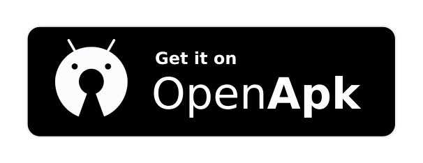</a>
&nbsp;
<a href="https://github.com/smartworldarafath/Open-GYM/releases"></a>
&nbsp;
<a href="https://apps.obtainium.imranr.dev/redirect?r=obtainium://app/%7B%22id%22%3A%22com.opengym.app%22%2C%22url%22%3A%22https%3A%2F%2Fgithub.com%2FArafath%2FGymMane%22%2C%22author%22%3A%22Arafath%22%2C%22name%22%3A%22GymMane%22%2C%22preferredApkIndex%22%3A0%2C%22additionalSettings%22%3A%22%7B%5C%22includePrereleases%5C%22%3Afalse%2C%5C%22fallbackToOlderReleases%5C%22%3Atrue%2C%5C%22filterReleaseTitlesByRegEx%5C%22%3A%5C%22%5C%22%2C%5C%22filterReleaseNotesByRegEx%5C%22%3A%5C%22%5C%22%2C%5C%22verifyLatestTag%5C%22%3Afalse%2C%5C%22dontSortReleasesList%5C%22%3Afalse%2C%5C%22useLatestAssetDateAsReleaseDate%5C%22%3Afalse%2C%5C%22trackOnly%5C%22%3Afalse%2C%5C%22versionExtractionRegEx%5C%22%3A%5C%22%5C%22%2C%5C%22matchGroupToUse%5C%22%3A%5C%22%5C%22%2C%5C%22versionDetection%5C%22%3Atrue%2C%5C%22releaseDateAsVersion%5C%22%3Afalse%2C%5C%22useVersionCodeAsOSVersion%5C%22%3Afalse%2C%5C%22apkFilterRegEx%5C%22%3A%5C%22%5C%22%2C%5C%22invertAPKFilter%5C%22%3Afalse%2C%5C%22autoApkFilterByArch%5C%22%3Atrue%2C%5C%22appName%5C%22%3A%5C%22%5C%22%2C%5C%22shizukuPretendToBeGooglePlay%5C%22%3Afalse%2C%5C%22allowInsecure%5C%22%3Afalse%2C%5C%22exemptFromBackgroundUpdates%5C%22%3Afalse%2C%5C%22skipUpdateNotifications%5C%22%3Afalse%2C%5C%22about%5C%22%3A%5C%22GymMane%20is%20an%20open%20source%20gym%20log%20for%20Android.%20Pick%20your%20muscles%20on%20a%20body%20map%2C%20log%20your%20sets%2C%20and%20watch%20your%20numbers%20grow.%20No%20accounts%2C%20no%20ads%2C%20no%20tracking%2C%20no%20internet%20permission.%5C%22%7D%22%2C%22overrideSource%22%3Anull%7D"></a>

<sub><a href="../../README.md">English</a> · <a href="README.es.md">Español</a> · <b>Italiano</b> · <a href="README.zh.md">简体中文</a></sub>

<br/>
<br/>


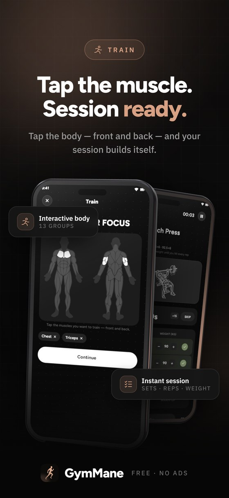


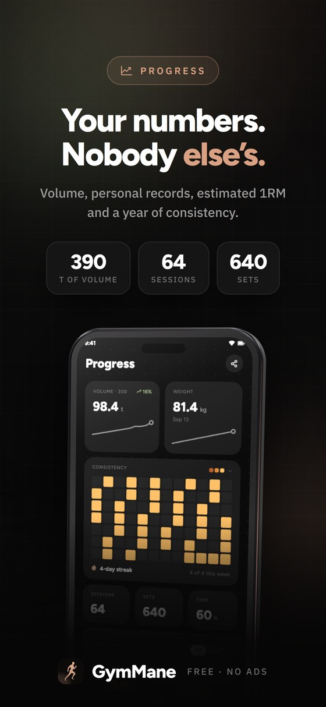
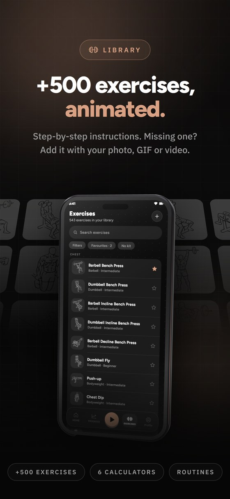


<details>
<summary><sub><b>Screenshot semplici</b>, tutte le schermate direttamente dal telefono</sub></summary>
<br/>

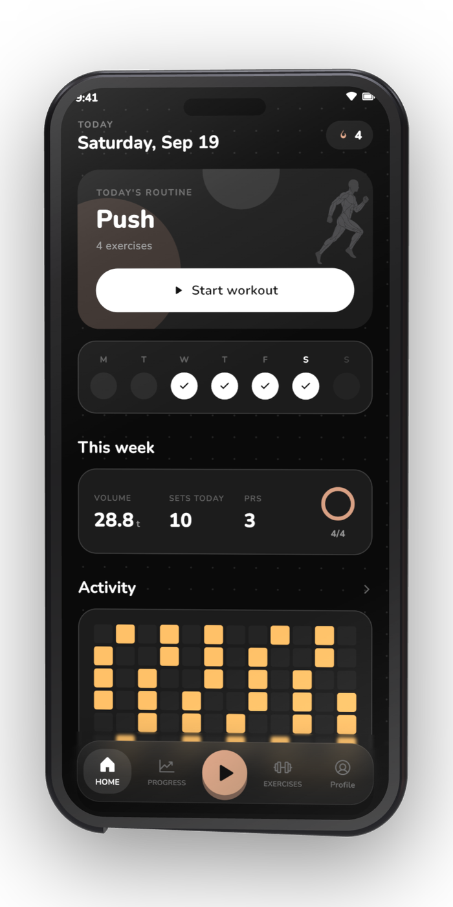
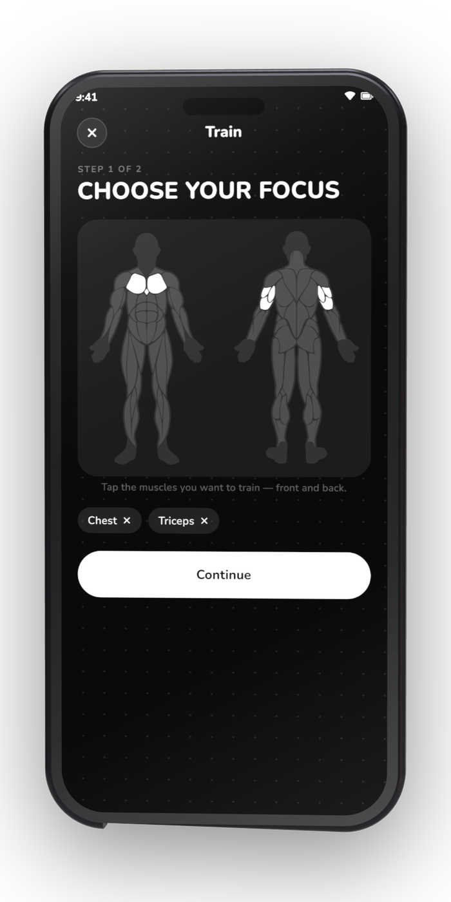
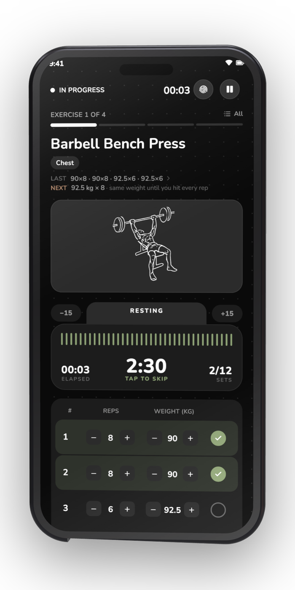
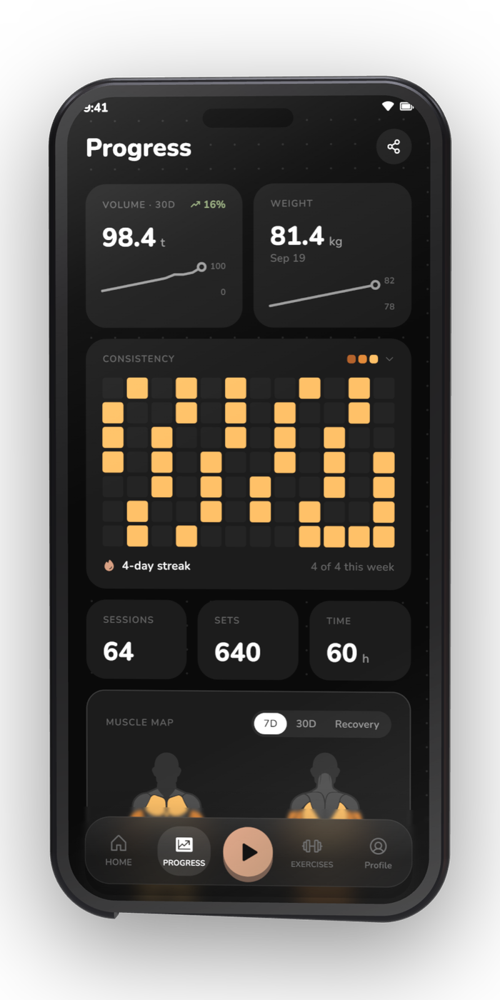

<sub><b>Oggi</b> &nbsp;·&nbsp; <b>Mappa del corpo</b> &nbsp;·&nbsp; <b>Sessione live</b> &nbsp;·&nbsp; <b>Progressi</b></sub>

<br/>
<br/>

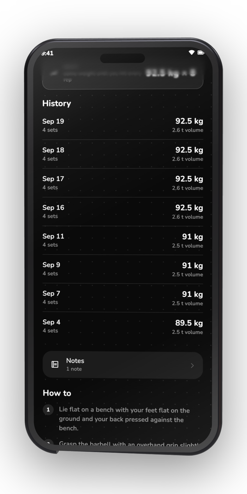
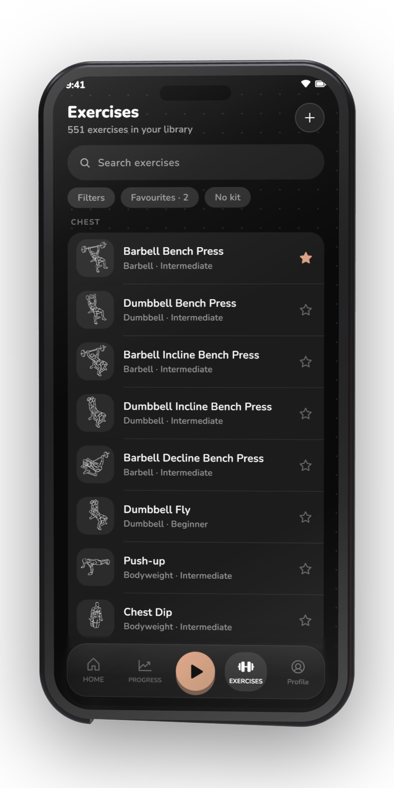
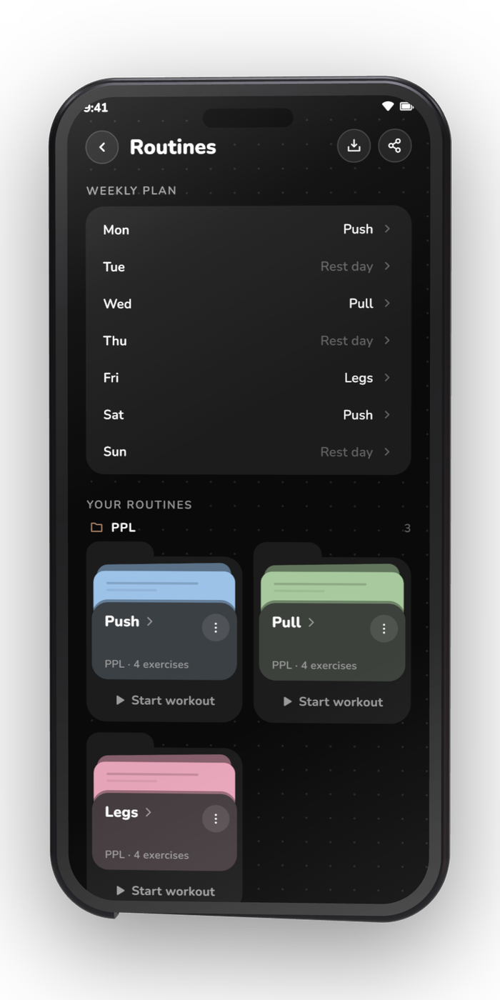
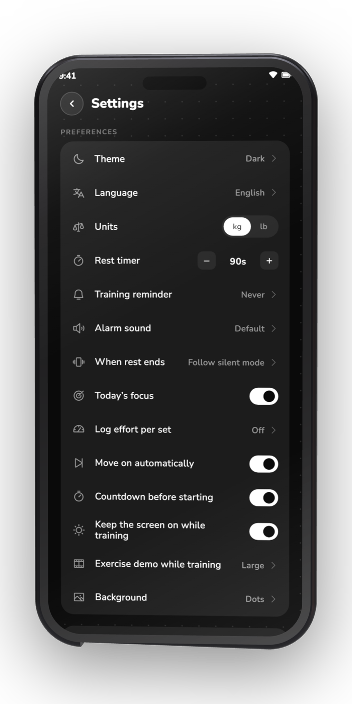

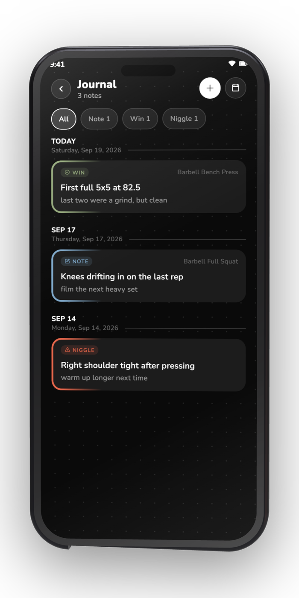
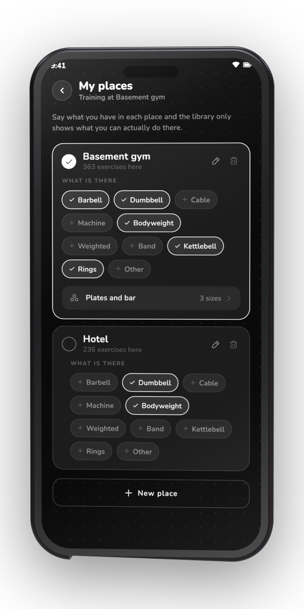
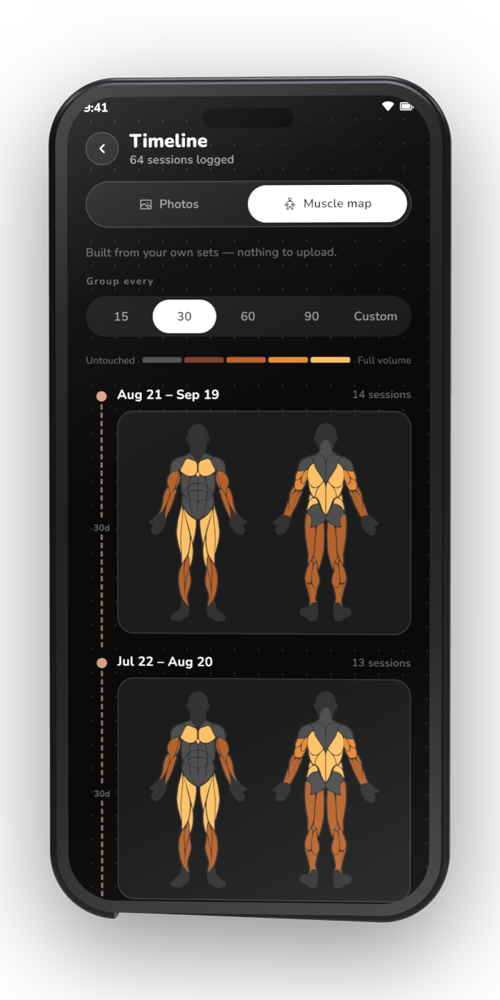
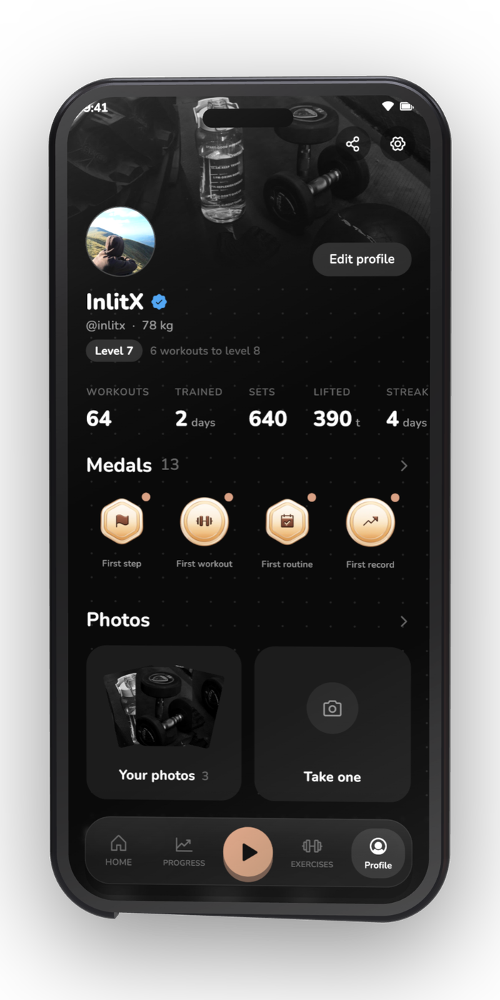

<sub><b>Storico</b> &nbsp;·&nbsp; <b>Libreria</b> &nbsp;·&nbsp; <b>Routine</b> &nbsp;·&nbsp; <b>Impostazioni</b></sub>

</details>

</div>

## Cosa fa

<table>
<tr>
<td width="50%" valign="top">

### Allenamento

- **Mappa del corpo**, fronte e retro: tocca quello che vuoi allenare
- Ripetizioni, peso e un **timer di recupero** con il tuo suono di sveglia
- **Tipi di serie** (riscaldamento, allenante, drop set, a cedimento) e RPE
  o RIR
- **Superserie**: collega un esercizio al successivo e salta il recupero
- **Dischi per lato**, calcolati con l'attrezzatura che hai
- **Routine** da raggruppare, duplicare e programmare, più piani già pronti
- Una **notifica in tempo reale** con il conto alla rovescia del recupero, e
  una sessione che sopravvive a un riavvio

</td>
<td width="50%" valign="top">

### Progressi

- Volume, serie di giorni, obiettivo settimanale e **record**, tutto dalle
  tue serie
- Una **mappa dell'attività**, il tuo ritmo settimanale e i totali di sempre
- **Curve di forza** con 1RM stimato, e la ripartizione muscolare
- **Foto dei progressi** su una linea del tempo, o la stessa linea disegnata
  sulla mappa muscolare
- Peso corporeo e **dieci misure**, ognuna con la sua curva
- Un **profilo** con livelli e **20 medaglie**
- Metti il tuo allenamento su una foto come **adesivo** e condividilo

</td>
</tr>
<tr>
<td width="50%" valign="top">

### Esercizi e strumenti

- **Oltre 500 esercizi** con animazioni e istruzioni passo passo
- Filtri per muscolo, attrezzatura e livello, e **i tuoi esercizi**
- Sostituisci il disegno di qualsiasi esercizio con **la tua foto, GIF o
  video**
- **Posti**: indica l'attrezzatura che hai e ti propone solo ciò che va bene
- Un **diario di allenamento** su un calendario, con foto e video
- **Sei calcolatori**: 1RM, dischi, BMI, calorie e macro, grasso corporeo,
  riscaldamento
- **Cinque widget**: oggi, questa settimana, attività, statistiche e mappa
  muscolare

</td>
<td width="50%" valign="top">

### I tuoi dati

- Esporta in **CSV** o in un **backup ZIP** completo, con foto e video, e
  reimportalo
- Porta il tuo storico da **Hevy**, **Strong**, **Lyfta**, **FitNotes**,
  **openGym** o da qualsiasi CSV
- **Routine con l'IA**: esporta la tua lista, incollala dove vuoi e importa
  la risposta
- Nessun account, niente pubblicità, niente analisi e nessun **permesso
  internet**
- Foto, video e note restano nella memoria dell'app
- **16 lingue**, tema chiaro e scuro, kg o lb
- Cancella tutto con un tocco

</td>
</tr>
</table>

## Download

Scaricala da F-Droid, IzzyOnDroid, OpenAPK, Obtainium o dalle
[release di GitHub](https://github.com/smartworldarafath/Open-GYM/releases/latest). Su GitHub, se non
sai quale APK scegliere, prendi `arm64-v8a`.

| Piattaforma | Stato |
|---|---|
| Android 7.0+ | Supportato |
| Wear OS 3+ | In sviluppo |
| iOS 15+ | In sviluppo |
| Desktop | In programma |

## Privacy

Nessun account, niente pubblicità e niente analisi. GymMane non ha nemmeno il
permesso internet, quindi i tuoi allenamenti restano sul telefono. I permessi
che chiede servono per il timer di recupero, la sua notifica e i widget.

## Contribuire

Segnalazioni di bug, idee e pull request sono benvenute. Per qualcosa di
grosso, apri prima una issue. Le traduzioni sono semplici file in
[lib/l10n](../../lib/l10n) e **TRANSLATING.md** spiega come aggiungerne una.

```bash
git clone https://github.com/smartworldarafath/Open-GYM.git
cd GymMane
flutter pub get
flutter build apk --release
```

## Supporto

GymMane è gratuita e resterà così. Una stella, una traduzione o una buona
segnalazione di bug aiutano molto. Se vuoi offrirmi un caffè:

<div align="center">

<a href="https://github.com/smartworldarafath"></a>

<table align="center">
  <tr>
    <td align="center" width="130"><br/><sub><b>Bitcoin</b></sub></td>
    <td><code>bc1qm0r4pg8nknnjh3a7n2t63ckafhsz8jdd6qer29</code></td>
  </tr>
  <tr>
    <td align="center" width="130"><br/><sub><b>Ethereum</b></sub></td>
    <td><code>0x34b7A5552132cBca150Ae29c1E632faA49430e1a</code></td>
  </tr>
  <tr>
    <td align="center" width="130"><br/><sub><b>Solana</b></sub></td>
    <td><code>DC8dNEUNJhWdtBHBZAn4FTheVC3W4PtkGhbazvtk17Jo</code></td>
  </tr>
  <tr>
    <td align="center" width="130"><br/><sub><b>Monero</b></sub></td>
    <td><code>44SECMEf3rfV228kpy3Gs48wLmLXnq231gAMG7ULYoCWBWLYLHdwYV7YFkhMk31DR5P7SRAyRPyhkYaehtgEoajASz7qubq</code></td>
  </tr>
</table>

</div>

## Licenza

Il codice è [GPL-3.0](../../LICENSE). Le illustrazioni degli esercizi vengono
da [Workout Guide](https://github.com/bryllim/workout-guide) di Bryl Lim, basato su
[Everkinetic](https://github.com/everkinetic/data), e sono
[CC BY-SA 4.0](https://creativecommons.org/licenses/by-sa/4.0/). I font usano la SIL Open
Font License. **CREDITS.md** ha i dettagli.

## Storico delle stelle

<a href="https://www.star-history.com/?repos=smartworldarafath%2Fgymmane&type=date&legend=top-left">
 <picture>
   <source media="(prefers-color-scheme: dark)" srcset="https://api.star-history.com/chart?repos=smartworldarafath/Open-GYM&type=date&theme=dark&legend=top-left" />
   <source media="(prefers-color-scheme: light)" srcset="https://api.star-history.com/chart?repos=smartworldarafath/Open-GYM&type=date&legend=top-left" />
   
 </picture>
</a>
